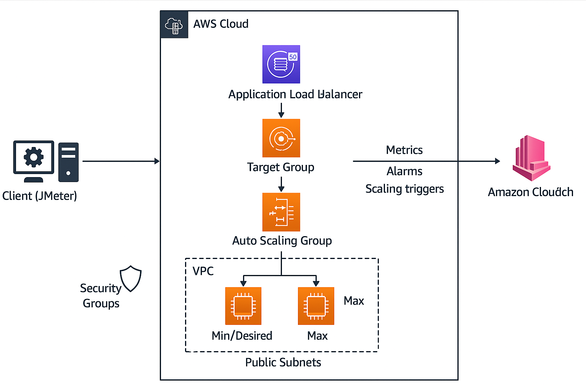

# 🏗️ AWS Auto Scaling Load Testing Project

This project demonstrates a complete AWS Auto Scaling environment validated with Apache JMeter load testing.  
It covers VPC networking, load balancing, auto-scaling policies, monitoring dashboards, and performance validation.

---

## 📘 Project Overview

This implementation includes:

- **VPC with public/private subnets**
- **Launch Template** for EC2 web server configuration
- **Auto Scaling Group (ASG)** across multiple AZs
- **Application Load Balancer (ALB)** to distribute traffic
- **CloudWatch Dashboard** & metrics (CPU, Requests, Network)
- **Step scaling policy** based on CPUUtilization
- **Apache JMeter** load testing (CLI mode)

---

## 🏛️ Architecture Diagram

# 📁 Repository Structure

/
│── diagrams/
│ └── architecture.png
│
│── screenshots/
│ ├── asg-scaling-out.png
│ ├── asg-scaling-in.png
│ ├── cloudwatch-dashboard.png
│ └── alb-target-group.png
│
│── results/
│ └── results.csv
│
│── test-plan.jmx
│── README.md
